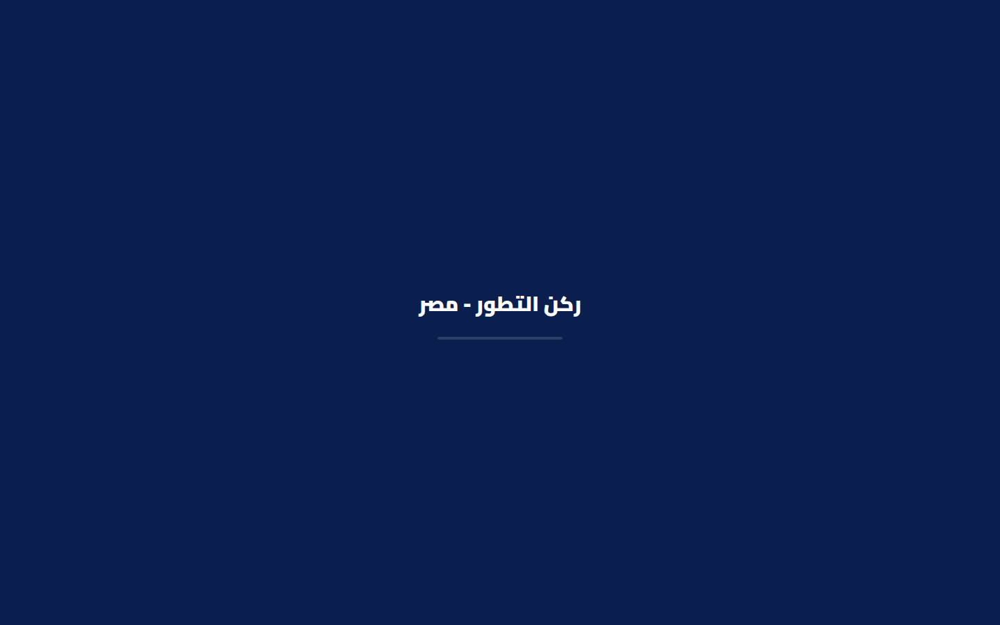
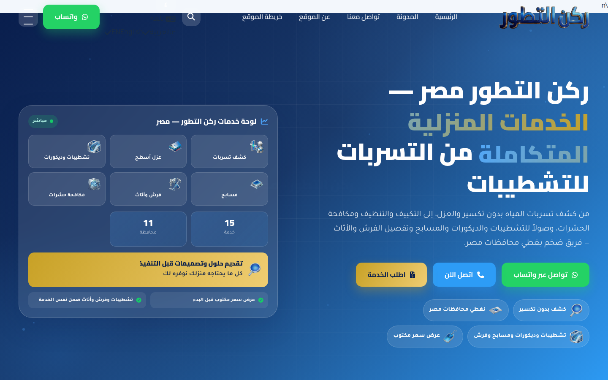

# ركن التطور مصر `/eg/` — فحص القالب 1.4.28 + محتوى سابق

Live: https://www.rukn-eltatawer.com/eg  
Active theme on the server: **KAYAN Theme 1.4.28** (`kayan-theme`, `style.css` Version 1.4.28)  
Inspected: 2026-09-23  
WordPress: 7.1.1

## Fixes applied 2026-09-23 (no theme-file writes)

`DISALLOW_FILE_EDIT` still blocks PHP/CSS in `kayan-theme`. Page-shape HTML from `Call-main.zip` is in `designs/Call-main/`. Live hotfixes went through `header___codes` + options. See `designs/README.md`.

| Before | After (verified) |
|---|---|
| Navy splash + overlapping «n» + desktop hamburger | Header: logo + nav + search + واتساب. No splash cover, no EN glyph, no desktop ham |
| `KayanPricePay` `"currency":"AED"` | **EGP** |
| `.uae-svg` UAE outline | Hidden via CSS |
| — | WPCode Lite installed; paste `designs/egypt-live-hotfixes.php` in wp-admin to serve `/eg/robots.txt` |

Screenshots: `docs/screenshots/header_after_fix_desktop.png`, `header_after_fix_mobile.png`, `contact_after_fix_desktop.png`.

No theme PHP/CSS/JS was edited. `DISALLOW_FILE_EDIT` still blocks WPVibe theme writes. This document records **why the header looks broken**, **UAE leftovers inside the theme**, and other theme gaps for the final KAYAN install.

Screenshots: `docs/screenshots/header_splash_navy.png`, `docs/screenshots/header_broken_after_splash.png`.

---

## Why the header looks broken

The nav HTML is not empty. The header prints a logo, five menu links, search, language switcher, WhatsApp, and a hamburger. It looks broken because **four independent CSS/JS faults stack on the same row**.

### 1. Navy splash covers the first paint (`#loader`)

Immediate load is only a full-screen navy screen with «ركن التطور - مصر»:



`components/packs/#header/part.php` prints `#loader` then JS that only adds class `out` (opacity 0). It never removes `body.before-start`. Fallback in CSS: `#loader{animation:ld-safety .4s 5s forwards}`. Until that runs, the header is invisible.

Live `<body>`: `mode="light" class="before-start kayan-lang-ar"`.

### 2. Language menu has no CSS in the delivered page → «n» over the logo

PHP injects a full AR/EN widget (`kayan_kit_render_header_lang_switcher()` in `kayan-ui/kit-pages.php`):

- Button label: «ع»
- Hidden-by-design dropdown: «اللغة / العربية / English (EN)»

On disk, `components/styles/rukn-v3.css` lines 478–503 define `.rukn-lc-menu{display:none;position:absolute;…}` and hide the dropdown until `.open`.

**The homepage `<style>` blob does not contain a single `.rukn-lc` rule** (count = 0). After `.icon-btn.lang-btn img{…}` the served CSS jumps straight to `.lang-item{`. The disk file has the whole language-switcher block between those two rules.

Without `display:none` / absolute positioning, the dropdown stays in normal flow. The glyph **n** overlapping the logo is the last letter of **EN**.

Header PHP even comments: «زر تبديل اللغة — موجود في القالب الحالي، غير موجود في ملفات الكِت».

### 3. Desktop hamburger stays visible (CSS order / missing `!important`)

Markup: `<button class="ham icon-btn">`.

Served CSS:

1. `.ham{display:none;…}` (desktop hide)
2. Later, same specificity: `.icon-btn{…display:grid;…}` ← **wins**
3. `@media(max-width:768px){ .ham{display:flex} }` never applies on desktop

On disk, 1.4.28 already has `.ham{display:none!important}` and `.ham{display:flex!important}` inside the mobile query. **That `!important` is not in the CSS the browser receives.** Result: hamburger sits next to WhatsApp + search while the full `<nav class="menu">` is still shown.

### 4. Too many CTAs in one RTL row

`.nav-cta` is `display:flex; gap:12px` with: search + unstyled language widget + واتساب + hamburger. The language dropdown’s in-flow width shoves tools into the logo.

After the splash, that is the broken header:



### What is *not* the current break

Legacy YourColor `header:before{background:#fff;width:100%;height:100%;opacity:1}` is still in the giant inline CSS, but Rukn v3 later sets `header::before{content:none!important;display:none!important}`. The live header is `#hdr` (not `fixedintro`). After splash the bar is navy/transparent, not a white sheet. A white overlay was the 1.4.12 failure mode; it is neutralized in the CSS that *is* served now.

### Why disk CSS ≠ served CSS

`#header/part.php` inlines `rukn-v3.css` with `require()` for non-allowlisted IPs (otherwise it prints a `<link>`). The file WPVibe reads **has** the lang-switcher block and `.ham !important`. The HTML actually sent to `https://www.rukn-eltatawer.com/eg/` does **not**. First check at final-theme install: purge LiteSpeed so the inline `<style>` is rebuilt from the current file. If it is still missing, the require path is not the file in `components/styles/rukn-v3.css`.

Do **not** hotfix this with `header___codes` unless asked. Theme-file edits stay deferred.

---

## UAE leftovers inside the theme (1.4.28 PHP/CSS)

Published posts/terms/cities on `/eg/` still have **0** دبي/أبوظبي/الإمارات rows. Leftovers below are **theme defaults / assets**, not post content.

### Visible on the live homepage

| What visitors see | Source |
|---|---|
| Coverage map SVG class **`.uae-svg`** (UAE outline) under «نغطي محافظات مصر» | `city__widget.php` always prints `<svg class="uae-svg">` — not gated on `use_default_content`. CSS comment: «خريطة الإمارات الكحلية» |
| `KayanPricePay` JS `"currency":"AED"` on every page | `kayan-price-pay/setup.php` `get_option('currency', 'AED')` |
| Hero/dashboard icons from **UAE parent**, not `/eg/`: `https://www.rukn-eltatawer.com/wp-content/uploads/icon/…` (19 URLs, 0 under `/eg/`) | Widget/image paths in the pack |

### Phone / WhatsApp defaults (used if options empty)

| File | Constant / placeholder | Value |
|---|---|---|
| `RuknContact/setup.php` | `RUKN_CS_DEFAULT_WA` | `971586634710` |
| same | `KAYAN_DRAIN_CALL` / `KAYAN_DRAIN_WA` | `+971541673020` / `971541673020` |
| same | `KAYAN_PLUMB_CALL` / `KAYAN_PLUMB_WA` | `+971567868605` |
| `kayan-ui/helpers.php` | same drain/plumb defines | duplicate UAE numbers |
| `RuknContact/setup.php` metaboxes | placeholders | `+9715xxxxxxxx` |

Live public tel/WhatsApp on key URLs is still **`+201007707742`** because options are filled. Empty option → UAE number.

### Widget / seed default copy (`use_default_content`)

| File | Default copy |
|---|---|
| `city__widget.php` | دبي، أبوظبي، الشارقة، عجمان، رأس الخيمة، الفجيرة، أم القيوين — title «خدماتنا في جميع إمارات الدولة» |
| `Faqs__simple2.php` | «هل تعملون في جميع إمارات الدولة؟» + seven emirates |
| `rukn_cases.php` / `rukn_results.php` / `works.php` | دبي مارينا، البرشاء، أبوظبي، عجمان |
| `rukn_reviews.php` | محمد الشمري / دبي مارينا، سارة البلوشي / البرشاء، فاطمة المنصوري / أبوظبي |
| `slider_intro_v1.php` | «معتمد من بلدية دبي» |
| `kayan-seed/setup.php` | same UAE demo pack |
| `rukn_stats.php` / `rukn_certs.php` / `rukn_compare.php` / `rukn_team.php` / `benefits.php` | «الإمارات» in default strings |

Homepage widgets 19–28 override most of this with Egypt copy. Unused published widgets **7, 8, 10–12, 15, 16** still serialize UAE text in `widget_post_meta`.

### i18n / money / booking defaults

| File | Leftover |
|---|---|
| `kayan-i18n/countries.php` | `ae` is first country; `path` empty (Egypt is `'eg' => path '/eg'` — doubles to `/eg/eg/` if i18n is on under subdirectory `/eg/`) |
| `kayan-i18n/content-map.php` | `'اختر الإمارة'`, دبي/أبوظبي/الشارقة, بلدية دبي, درهم → AED, «نعمل … في دولة الإمارات» |
| `kayan-booking/setup.php` | `kayan_booking_currency` default **AED** |
| `Database/DB/kayan-payment.php` + `kayan-booking.php` | `currency … DEFAULT 'AED'` |
| `FieldsMachine/.../booking_settings.php` | field value `AED` |
| `shortcodes/codes/price_list.php` | empty currency → `AED` |
| `FieldsMachine/.../price.php` | `AED=>'درهم'` in the default list (no EGP) |

---

## Other theme errors / gaps (not UAE copy)

| Item | Live fact |
|---|---|
| `/eg/robots.txt` | **404 HTML**. ThemeStatic runs before `is_robots()`. Domain-root `https://www.rukn-eltatawer.com/robots.txt` exists and lists Egypt + SA sitemaps |
| `/eg/en/` | `html lang="en" dir="ltr"` now (1.4.28 uses `kayan_i18n_get_html_attrs()`). **Body is still the Arabic homepage** (same H1). Title remains Arabic. Not a real English front |
| `<link rel="preload" as="font">` | no `href` — invalid |
| Font Awesome | requested three times (`all.min.css` + `fa-free-fixes.css?v=1.4.26` + extra) |
| Footer jQuery | still bundled `jquery-3.4.1.min.js` |
| Mixed host | menu links mix `https://rukn-eltatawer.com/eg/` (no www) and `www.` |
| Canonical | homepage currently `https://www.rukn-eltatawer.com/eg/` via Rank Math data. Re-enable `kayan-i18n` → risk of `/eg/eg/` because Egypt `path` is `'/eg'` |
| KAYAN SEO | pack still disables Rank Math `Head::head`. Keep `kayan_seo_disable=1` until the final theme prints title/OG itself **or** stops disabling Rank Math |
| Missing templates | `/blog/`, `/cities/` 404 by design (`index.php` + ThemeStatic) |
| `#hdr` | no CSS `#hdr{…}` rules; header is styled as bare `header` |

---

## Scope of the previous content-data round (unchanged)

Egypt’s theme will later be replaced by the **final UAE KAYAN build**. That round:

- **Did not** edit theme PHP/CSS/JS.
- **Did not** patch Canonical, `robots.txt`, `/en/`, UAE strings inside theme PHP, or KAYAN SEO.
- **Did** change `/eg/` posts, pages, plugin options, and taxonomies that do not depend on theme files.

Already-applied live options stay as-is (`kayan_seo_disable=1`, `kayan_i18n_disable=1`, Egypt phone, Egypt menu).

---

## Content / data scan (no theme files)

### Clean in published posts, terms, and city taxonomies

| Check | Result |
|---|---|
| Published `post_content` / titles containing دبي، أبوظبي، الإمارات، درهم، +971, Dubai, Emirates | **0 rows** |
| `cities` taxonomy (131 terms) | Egypt only |
| Tags (198) | no UAE leftovers |
| `kayan_numbers` table | empty |
| Public tel/WhatsApp on key URLs | `+201007707742` / `wa.me/+201007707742` |

English service posts that mention **AED** do so as a negation (“priced in Egyptian pounds — not Gulf villas or AED rate cards”). That is Egypt positioning, not leftover UAE copy.

### Leftovers that are data, not PHP

| Location | What it is | Action this round |
|---|---|---|
| `widgets__posts` **7, 8, 10, 11, 12, 15, 16** (published, old homepage pack) | Serialized `widget_post_meta` still has UAE copy, e.g. «ثقة الآلاف … في جميع أنحاء **الإمارات**», «خدماتنا في جميع **إمارات الدولة**» | Attempted `draft`; WPVibe refused `widgets__posts`. Live homepage currently uses Egypt widgets **19–28** (`اختر المدينة`, Cairo/Giza/…). **Remaining data** — draft or rewrite in wp-admin, or at final-theme install. |
| Widgets **19–28** | Egypt homepage widgets, status `future`; theme still renders them | Left untouched (content already Egypt). |
| `kayan_seo_home_reviews` | Option matches الإمارات in SQL | Left untouched (**KAYAN SEO** deferred). |
| `KayanPricePay` JS (`currency: "AED"`) | `wp_localize_script` from theme pack `kayan-price-pay` | Theme PHP — deferred. |
| CSS class `.uae-svg` / comment «خريطة الإمارات الكحلية» | Theme CSS + `city__widget.php` | Deferred. Visible on the Egypt coverage map. |

### Thin / stub content that *is* WordPress data

Nine published posts were 4–9 words (old service stubs). Pages 1725–1727 were 2 short paragraphs. Page **3** was the default WordPress English “Suggested text” privacy policy at `/eg/en/privacy-policy/`. CPT `services` #3042 was «صيانة عامه للمباني».

Duplicate/empty categories remain from Polylang (`cleaning-en` count 0 vs `cleaning-en-en`, `غير مصنف` 96 English posts, 318 English posts under Cleaning). **`/en/` routing is deferred**; only the nine Arabic stubs were recategorized.

---

## Content / data fixes applied on the live site

Phone options remain `+201007707742`. No theme files were written.

### Rank Math (plugin options, not theme)

| Field | Before | After (live HTML) |
|---|---|---|
| `opening_hours` | `09:00-17:00` (mismatched contact 9am–9pm Cairo) | **`09:00-21:00` every day** |
| Local address | missing → JSON-LD had no `PostalAddress` | القاهرة / EG |
| `price_range` | missing | **EGP** |
| `url` / about / contact pages | missing | `/eg`, `/eg/about-egypt/`, `/eg/contact-us/` |
| Breadcrumbs 404 / archive / search | English | Arabic |
| Rank Math TOC title | `Table of Contents` | **محتويات الصفحة** |

After filling Rank Math’s website `url` + address, the homepage **canonical**, `og:url`, and CollectionPage `@id` currently print `https://rukn-eltatawer.com/eg/` (no extra `/eg/eg/`). That came from **plugin data**, not a theme PHP patch. Treat doubled `/eg/eg/` as a **theme/i18n regression risk** when the final KAYAN pack is installed.

`phone` / `knowledgegraph_phone` were already `+201007707742`. JSON-LD **still has no `telephone`**. Rank Math is not emitting it from those fields without a Local SEO location object. Remaining plugin-data gap; not theme PHP.

### Easy TOC (plugin)

- `heading_text` → **محتويات الصفحة**
- `heading-text-direction` → **rtl**

### Posts / pages / service CPT

| ID | URL | Change |
|---|---|---|
| 3008 | كشف تسربات المياه | Full Egypt article; category → `leaks-insulation` (238) |
| 3009 | عزل الأسطح | Full Egypt article; category → `leaks-insulation` (238) |
| 3010 | صيانة التكييف | Full Egypt article; category → `maintenance` (236) |
| 3011 | تنظيف وتعقيم | Full Egypt article; category → `cleaning` (237) |
| 3012 | مكافحة الحشرات | Full Egypt article; category → `pest-control` (239) |
| 3013 | سباكة وصيانة عامة | Full Egypt article; category → `maintenance` (236) |
| 3024 | نصائح للعناية بالمنزل | Full Egypt article; category → `maintenance` (236) |
| 3025 | متى تحتاج لفحص التسربات؟ | Full Egypt article; category → `leaks-insulation` (238) |
| 3026 | أهمية الصيانة الدورية | Full Egypt article; category → `maintenance` (236) |
| 3042 | `/eg/services/general-maintenance/` | Egypt service body (EGP, Cairo hours, +201007707742) |
| 1725 | `/eg/contact-us/` | Hours 9–9 Cairo, what to send, same phone |
| 1726 | `/eg/about-egypt/` | Egypt-only positioning (not a Gulf branch / AED) |
| 1727 | `/eg/privacy-egypt/` | Real Arabic privacy for `/eg/` |
| 3 | `/eg/en/privacy-policy/` | Replaced WP “Suggested text” stub with Egypt English privacy (same phone). **Did not change `/en/` routing.** |

LiteSpeed + object cache purged after the writes.

Live checks after purge: contact/about/privacy/AC/service pages show the new copy and `+201007707742`. Finder step 2 remains **اختر المدينة**. Homepage schema hours **09:00–21:00**, `priceRange` EGP, address القاهرة.

---

## Remaining `/eg/` content (not theme files)

These can wait for a later content pass; they were out of the “no theme, no `/en/` routing” slice.

| Item | Notes |
|---|---|
| ~842 city×service articles | Thin/template; unique ratio low (see SEO audit PR). Not rewritten. |
| English categories | 318 posts under `cleaning-en-en`; empty `*-en` twins; `غير مصنف` on `/en/`. Tied to `/en/` / Polylang — deferred. |
| Featured images | Still none on posts. |
| UAE widget posts 6–18 | Published leftover pack; WPVibe cannot `post update` `widgets__posts`. Draft or delete in wp-admin. |
| Rank Math `telephone` in JSON-LD | Phone option is set; graph still omits `telephone`. Add a Local SEO location in Rank Math UI if the field is required. |
| Widget posts 19–28 status `future` | Harmless while the theme renders them; publish in wp-admin if desired. |

---

## Do not re-enable KAYAN SEO or i18n on this install

Until the **final** theme prints `<title>` / canonical / OG and uses an empty Egypt path under `/eg/`, keep:

```
kayan_seo_disable = 1
kayan_i18n_disable = 1
kayan_i18n_default_country = eg
```

Re-enabling either pack on this build will blank titles and/or double URLs to `/eg/eg/` again.

Header fix for the final theme (do not apply on this Egypt copy):

1. Purge LiteSpeed so inlined `rukn-v3.css` matches the file on disk (lang-switcher + `.ham !important`).
2. Keep `.ham{display:none!important}` (or drop class `icon-btn` from the hamburger).
3. Ensure `.rukn-lc-menu{display:none}` is in the CSS the browser actually gets.
4. Remove `body.before-start` when `#loader` gets `.out`, or drop the splash on `/eg/`.
5. Replace `.uae-svg` with an Egypt map; default currency/phone/i18n path to EGP / `+20` / empty Egypt `path`.
